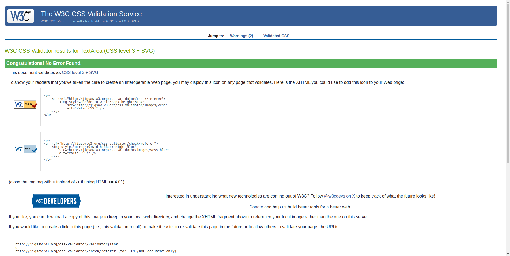
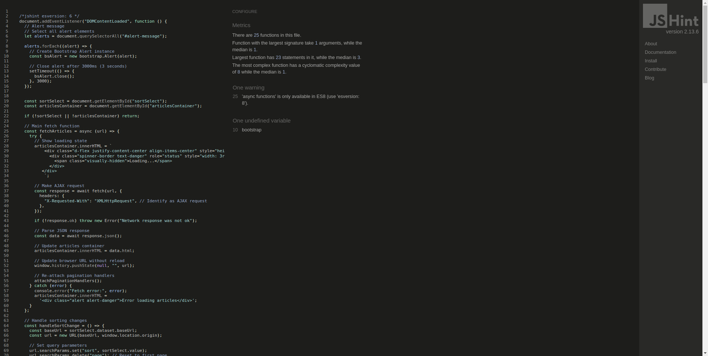

# NC_NEWS!

- Deployed project can be found [here](https://nc-news-54e823fb4d1d.herokuapp.com/).

# 📰 A note on NC_News 
NC News is a social news aggregation, web content rating, and discussion platform built using Django as part of my Code Institute Full-Stack project. The website features articles that can be browsed by topic and sorted by comment count, creation date, and vote count. Users can view individual articles, upvote or downvote them, and engage in discussions by adding or deleting comments. 

# 📰 NC News - User Experience  

### 1️⃣ Homepage Experience  
✅ Users land on a **clean, intuitive homepage** showcasing **recent, trending, and most discussed articles**.  
✅ **Register & Login** options are available directly on the homepage, allowing users to **create an account or log in** easily.  
✅ Users can see article previews with **titles, thumbnails, author names, and vote counts**.  

### 2️⃣ Article Browsing & Sorting  
✅ Users can **browse articles by topic** (e.g., **Coding, Cooking, Football**).  
✅ Sorting options include:  
   - **🆕 Newest First** (latest articles)  
   - **💬 Most Commented**  
   - **⬆️⬇️ Highest Voted**  
✅ Clicking an article takes the user to a **detailed article page**.  

### 3️⃣ Article Interaction  
✅ Logged-in users can **upvote articles**.  
✅ Votes update **instantly** without a page reload (**AJAX or Django + JavaScript**).  
✅ Users can view the article’s **author, created date, and full content**.  

### 4️⃣ Commenting System  
✅ Logged-in users can **post comments** on articles.  
✅ Comments appear **instantly** with a **live update** feature.  
✅ Users can **upvote comments** to highlight the best discussions.  
✅ Users can **delete their own comments**.  

### 5️⃣ Authentication & User Profile  
✅ Users can **sign up, log in, and log out** securely.    

### 6️⃣ Responsive & Mobile-Friendly Design  
✅ The site is **fully responsive** and works seamlessly on **desktop, tablet, and mobile**.  
✅ A **clean UI with easy navigation** enhances the user experience.  

### 7️⃣ Error Handling & Feedback  
✅ **Helpful error messages** for login, voting, or commenting issues.  
✅ **Loading indicators** for slow network responses.  

### 8️⃣ Admin Features (For You as an Admin)  
✅ **Manage articles, comments, and users** from the Django admin panel.  
✅ **Moderate comments** (e.g., delete inappropriate content).  

# Agile methodology
- Agile methodology is "a set of methods and practices where solutions evolve through collaboration between self-organizing, cross-functional teams" ([reference](https://www.agilealliance.org/agile-essentials/)).
- A project board was set-up to keep track of user stories. The board can be found [here](https://github.com/users/SardarAmiri/projects/16).

# User Stories

## Article Browsing & Viewing

### 1. View List of Articles  
**As a website user**, I can see a list of all articles presented in an engaging and accessible way, so that I can easily browse through available content and choose articles of interest.  
✅ **Acceptance Criteria:**  
- Article cards should display the title, thumbnail, date, snippet, and author, with an accessible design.  
- Articles should be arranged in a grid for larger screens and a single column for smaller screens.  
- The layout must be fully responsive, accessible, and keyboard-navigable with proper alt text for images.  
- Show loading placeholders during load time and a "No articles found" message if the list is empty.

### 2. Read Individual Article  
**As a website user**, I can go to a new page to read an individual article, so that I can focus on the content and read it in full detail without distractions.  
✅ **Acceptance Criteria:**  
- The individual article page should display the title, publication date, author name, full article content, and relevant images or media.  
- The header (e.g., logo, navigation menu) and footer (e.g., contact info, links) should remain on the screen for consistent navigation.  
- The layout must be responsive and accessible, ensuring readability across all screen sizes and devices.  
- Include a "Back to Articles" button or link for easy navigation to the previous page.

## Comments & Interaction

### 3. View Article Comments  
**As a website user**, I can see the comments linked with an individual article displayed alongside it, so that I can engage with the content and view other readers' perspectives.  
✅ **Acceptance Criteria:**  
- Each comment card should display the commenter's name, the comment text, and the timestamp, with a clean and accessible design.  
- Comments should be arranged in a vertical list below or alongside the article content, depending on the screen size.  
- The layout must be responsive, ensuring comments remain readable and well-arranged across all device types.  
- The most recent comments should appear at the top of the list.

### 4. Vote on Articles  
**As a website user**, I can vote on the article I am reading so that I can express my opinion about the content's quality or relevance.  
✅ **Acceptance Criteria:**  
- The current number of votes should be displayed prominently near the article title or header in a clear and accessible format.  
- Users should be able to upvote using upvote buttons with clear icons (e.g., heart).  
- Changes to the vote count should be rendered optimistically on the UI for a smooth user experience, even before the server responds.  
- Prevent users from voting multiple times on the same article unless allowed, and visually indicate their current vote (e.g., highlight the button they selected).

### 5. Add Comments  
**As a website user**, I can add a new comment to the article I am reading so that I can share my thoughts or feedback on the content with other readers.  
✅ **Acceptance Criteria:**  
- Users should be able to submit a comment via a text input field located below the article or at the bottom of the existing comment section.  
- The input field should be accompanied by an "Add comment" button to post the comment.  
- Immediately render the new comment below the existing ones to show the user their comment without delay.

### 6. Delete Comments  
**As a website user**, I can delete my own comment on the article I am reading so that I can remove content that I no longer want to be associated with the article.  
✅ **Acceptance Criteria:**  
- Only the author of a comment should see a "Delete" button or icon (e.g., a trash can) next to their own comment.  
- Ensure the deletion is reflected in the UI immediately while the server request is processed in the background.

## Content Organization

### 7. Browse by Topics  
**As a website user**, I can view the different topics and select a topic to view associated articles so that I can browse articles based on my interests.  
✅ **Acceptance Criteria:**  
- Display a list of topics on the website (e.g., in a sidebar, dropdown, or header), with each topic clearly labelled.  
- Each topic should be clickable, leading the user to a new page that displays articles related to that topic.

### 8. Sort Articles  
**As a website user**, I can sort how the articles are presented to me based on different criteria so that I can view articles in a way that suits my preferences.  
✅ **Acceptance Criteria:**  
- Provide sorting options that allow the user to sort articles by:  
    - Date (most recent or oldest).  
    - Comment Count (from most comments to least).  
    - Votes (from most votes to least).  
- Each sorting option should be clearly labelled (e.g., "Sort by Date", "Sort by Comment Count", "Sort by Votes").  
- Allow users to flip the sorting order between ascending and descending by clicking a toggle or an arrow next to the sorting criteria (e.g., “↑” for ascending, “↓” for descending).  
- The order toggle should be clearly visible and easy to interact with.

## User Authentication

### 9. Register Account  
**As a new user**, I can register for an account on the website so that I can access personalized features, such as commenting and voting on articles.  
✅ **Acceptance Criteria:**  
- Provide a registration form with fields for email, username, password, and password confirmation.  
- Validate the form to ensure required fields are filled and inputs are correct (e.g., email format, unique username).  
- Display a confirmation message upon successful registration and redirect to the login page.  
- Implement Django’s built-in User model for registration and password validation.

### 10. Log In  
**As a registered user**, I can log in to my account so that I can access personalized features, such as commenting and voting on articles.  
✅ **Acceptance Criteria:**  
- Provide a login form with fields for email/username and password.  
- Authenticate the credentials and display an error message if the login is unsuccessful.  
- Redirect the user to the homepage or the original page after successful login.  
- Use Django’s built-in authentication views for login, session management, and security.

### 11. Log Out  
**As a registered user**, I can securely log out of my account so that I can prevent unauthorized access to my account on shared or personal devices.  
✅ **Acceptance Criteria:**  
- When I click the "Logout" button, I should be logged out and redirected to the login page or homepage.  
- I will then see a confirmation message that says, "You have been logged out successfully."

# Wireframes
- [Click here for design wireframe](static/images/pup-wireframe.png)

# Color Scheme

## General Styles

- **Light Grey Background (Breadcrumb Container)**  
  - Hex: `#f1f4f6`  
  - Description: Light grey background used for the breadcrumb container.

- **Black (Text and Active States)**  
  - Hex: `#000000`  
  - Description: Used for text color and the background of active carousel indicators, as well as for the "all-articles" button's text and border.

- **Red (Footer Social Icons Hover)**  
  - Hex: `#ff0000`  
  - Description: Used for the hover effect color on social icons in the footer.

- **White (All Articles Button Background on Hover)**  
  - Hex: `#FFFFFF`  
  - Description: Background color for the "all-articles" button when hovered over.

## Button and Hover Styles

- **All Articles Button (Normal State)**  
  - Background Color: `#000000` (Black)  
  - Text Color: `#FFFFFF` (White)  
  - Border Color: `#000000` (Black)  

- **All Articles Button (Hover State)**  
  - Background Color: `#000000` (Black)  
  - Text Color: `#FFFFFF` (White)  

## Icon Hover Styles

- **Icon Hover**  
  - Hover Color: `#ff0000` (Red)  
  - Hover Effect: Scale the icon to 1.3x its size.

# Typography

## Font Sizes

- **Navbar Brand**  
  - Font Size: `24px`  
  - Description: Font size for the navbar brand.

- **Emoji**  
  - Font Size: `20px`  
  - Description: Font size for the emoji class.

- **Nav Links, Dropdown Items, and Navbar Brand (Custom Navbar)**  
  - Padding: `1rem`  
  - Description: Standard padding for nav links, dropdown items, and navbar brand in the custom navbar.

- **Active Nav Link**  
  - Font Weight: `bold`  
  - Description: Bold font weight for the active nav link.

- **"All Articles" Button**  
  - Font Weight: `bold`  
  - Description: Bold font weight for the "all-articles" button.
  - Font Family: `'Roboto', sans-serif`  
  - Description: The font family for the "all-articles" button text.

## Images
- All article images are uploaded to the media folder in the root directory.

## Features
### Homepage
- The homepage features a carousel that displays the 3 most recently added articles, with each article card showing the title, thumbnail image, author, and linking to the article details page. The carousel will rotate through the articles, each displaying the article’s title, thumbnail image, author, and the date. Below the carousel, there is a section displaying the first 3 recently added articles. At the bottom of the homepage, there is an "All Articles" button that takes the user to a page with a complete list of all available articles. The navigation bar will include links to the homepage, article topics, and other sections like login and register. The footer will include contact information, social media links, and additional useful information.
- 

### Articles
- The article pages feature a breadcrumb with a Home button, which allows users to easily navigate back to the homepage. Additionally, there is a Sort by dropdown, enabling users to sort articles based on date, number of votes, or number of comments. This sorting functionality dynamically updates the page without requiring a reload, leveraging AJAX and JavaScript to fetch and display new data.

- Each page displays 6 articles by default, and users can navigate through different pages using the pagination controls at the bottom of the page. The pagination allows users to move to the next or previous page, enhancing the browsing experience.
- 

### Topic Page
- On the topic page, when a user clicks on a topic, a list of articles associated with that topic will be displayed. This allows users to explore content relevant to their interests within the selected topic.
- 
- 
- 

### Article details page
- The article details page displays comprehensive information about the article, including the title, thumbnail image, author, date, and topic. Below the thumbnail image, users will find a heart button for voting on the article, alongside the number of comments that the article has received. Users can upvote by pressing the heart button, and the vote count will update immediately without reloading the page. This functionality is powered by AJAX and JavaScript, which fetch data from the backend and display the updated data seamlessly.

- At the bottom of the article, there is a "Show Comments" button. When clicked, users can view a list of available comments. An input field allows users to add their own comment, and the new comment will be added instantly to the list. Each comment includes a thumbs-up button for voting and a delete button. The delete button appears only for comments authored by the user, allowing them to delete their own comments. After a comment is deleted, the number of comments is updated dynamically.
- 
- 

### Registering
- In the header, if you are not already logged in, you can press the 'Register' button which will take you to the registration page.
- 

### Logging in
- In the header, if you are not already logged in, you can press the 'Login' button which will take you to the log-in page.
- 

### Logging out
- In the header, if you are logged in, you can press the 'Logout' button which will take you to the log-out page.
- 

### The admin panel 
- The admin panel is accessible by the superuser. This is where the NC_News (Staff) can add new articles and manage the content of the page.
- 

### Footer
- In the footer, it is common to have icons leading to a companies social media pages such as Facebook, Instagram and X. As 'NC_News' does not have any socials, I have include the linkedin and github icon likned to my personal account.

## Database
- I used Code Institute's PostgreSQL database.

### Database planning
- I used an Entity Relationship Diagram to plan my database.
- 

### Creating a database
1. Navigate to [PostgreSQL](https://dbs.ci-dbs.net/) from Code Institute.
2. Enter your student email address in the input field provided.
3. Click Submit.
4. Wait while the database is created.
5. Check your email.
6. You now have a URL you can use to connect your app to your database.

## Deployment
- The website was deployed to Heroku and can be found [here](https://nc-news-54e823fb4d1d.herokuapp.com/).
### Heroku
* Heroku is a cloud platform that lets developers create, deploy, monitor and manage apps.
- You will need a Heroku log-in to be able to deploy a website to Heroku.
- Once you have logged into Heroku:
1. Click 'New' > 'Create new app'
2. Choose a unique name, choose your region and press 'Create app'
3. Click on 'Settings' and then 'Reveal Config Vars'
4. Add a key of 'DISABLE_COLLECTSTATIC' with a value of '1'.
5. Add a key of 'DATABASE_URL' - the value will be the URL you were emailed when creating your database.
6. Add a key of 'SECRET_KEY' - the value will be any random secret key (google 'secret key generator' and use it to generate a random string of numbers, letters and characters)
7. In your terminal, type the code you will need to install project requirements:
- pip3 install gunicorn~=20.1
- pip3 install -r requirements.txt
- pip3 freeze --local > requirements.txt
8. Create an 'env.py' file at the root directory which contains the following:
    - import os
    - 
    - os.environ["DATABASE_URL"]='CI database URL'
    - os.environ["SECRET_KEY"]=" Your secret key"
8. Create a file at the root directory called Procfile. In this file enter: "web: gunicorn my_project.wsgi" (without the quotes)
9. In settings.py, set DEBUG to False. 
- YOU SHOULD ALWAYS SET DEBUG TO FALSE BEFORE DEPLOYING FOR SECURITY
10. Add ",'.herokuapp.com' " (without the double quotes) to the ALLOWED_HOSTS list in settings.py
11. Add, commit and push your code.
12. Go back to Heroku, click on the 'Deploy' tab.
13. Connect your project to GitHub.
14. Scroll to the bottom and click 'Deploy Branch' and your project will be deployed!

### Cloning
- To clone a GitHub repository:
1. On GitHub.com, navigate to the repository you want to clone.
2. Click the "Code" button (found above the list of files).
3. Copy the URL for the repository.
4. Open Git Bash or your chosen terminal.
5. Navigate to the directory where you want to clone the repository.
6. Type: git clone https://github.com/SardarAmiri/nc-news.git
7. Press Enter to create your local clone.

### Forking
- 'Forking' the GitHub repository means creating a copy which can be viewed/changed without changing the original.
- To fork a GitHub repository:
1. Login to GitHub and navigate to the repository you want to fork.
2. Click the "Fork" button (found above the Settings button).
3. You will now have a copy of the original repository in your GitHub account.

*Once the project is cloned or forked, in order to run it locally, you'll need to follow these steps:

- Run the server: python3 manage.py runserver
- Stop the app once it's loaded: CTRL+C or ⌘+C
- Make any necessary migrations: python3 manage.py makemigrations
- Migrate the data to the database: python3 manage.py migrate
- Create a superuser: python3 manage.py createsuperuser

## Technologies used
- HTML was used to structure the content of the website.
- CSS were used to design the layout of the website.
- Bootstrap was used as a CSS framework to provide a grid structure and improve responsiveness.
- Python and Django were used to build the backend review framework.
- GitHub was used to host the repository and version control.
- Heroku was the hosting platform.

# Validation
## CSS
- 

## JavaScript
- 

# Lighthouse Performance
- 
- 
- 
- 
## Credits
- I used the "I Think Therefore I Blog" walkthrough from the course content as a basis for my project to help me understand the Django. I customised the models, views and templates to create my own unique website. 
- [Traversymedia)](https://www.traversymedia.com/Python-Django-Dev-To-Deployment) tutorial helped me to learn the code to implement my 'voting and commenting'.
- [bootstrapbrain.com](https://bootstrapbrain.com/demo/?s=templates/planet/planet-pro/) used the Palnet bootstrap theme.
- [DeepSeek](https://htmlcolorcodes.com/color-picker/) was used to help understand the AJAX request and generated some part of my code.

- [Copilet](https://fonts.google.com/) were used to generate code
- Balsamiq was used to create the design wireframe.
- miro.com was used to create the ERD image.

